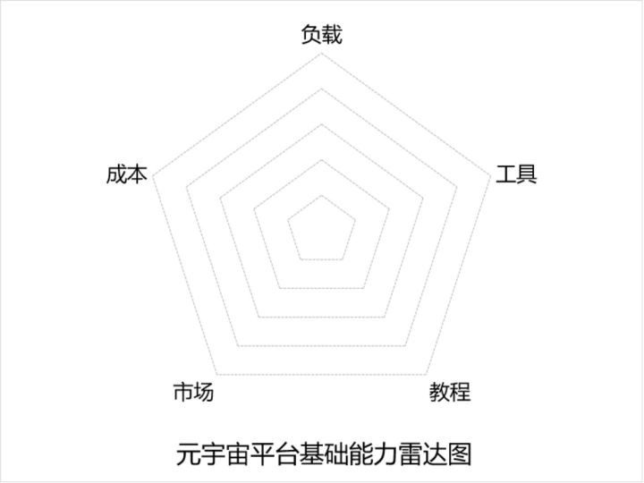
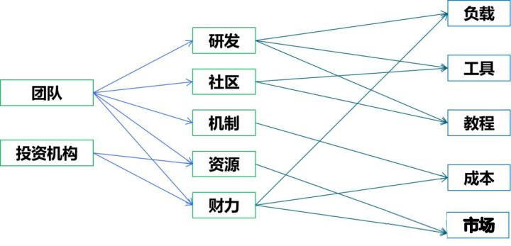
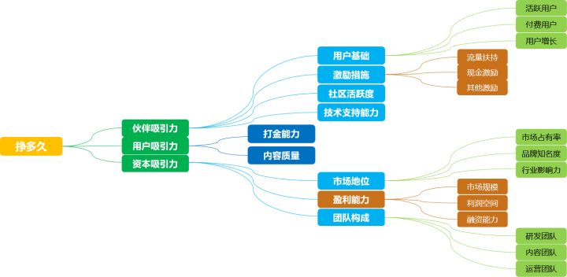
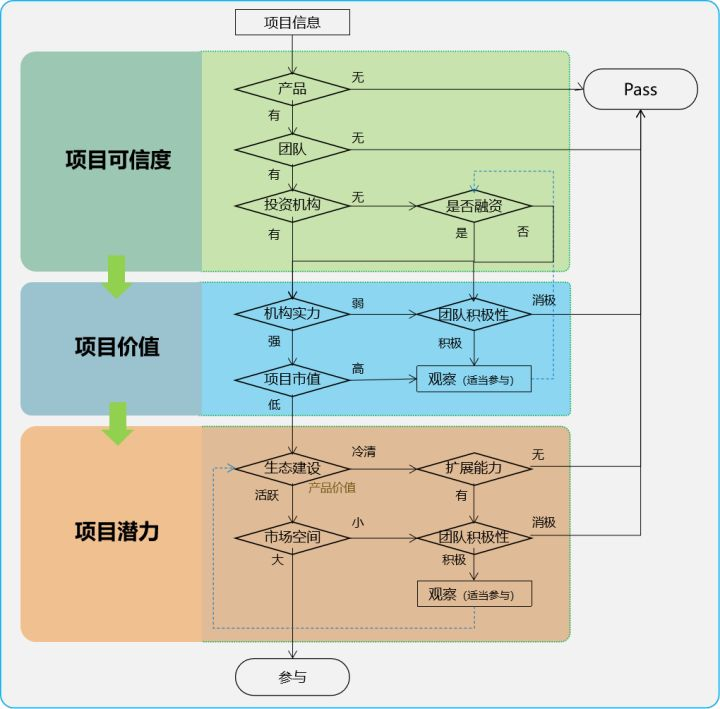

元宇宙项目的价值判断标准很简单——让多少人挣到钱。

- 一流的项目，可以让成千上万的人致富，就像亚马逊、苹果、谷歌、微软、淘宝、微信、抖音……
- 二流的项目，可以让成千上万的人谋生，就像滴滴、美团；
- 三流的项目，可以让成千上万的人挣点零花钱，像闲鱼、各种内容付费平台之类；
- 四流的项目，只有项目方赚钱，就像摩拜单车；
- 五流的项目，所有人都赔钱，就像OFO。

所以，优质的元宇宙项目应该是一个平台，可以发展出自己的生态，并且大部分生态的建设者都能够从中获利。具体的优劣程度，可以通过三个维度来判断，即多少人、多少钱、挣多久。

**具体而言，就是：**

1. 多少人。该项目可以让多少人挣到钱。
2. 挣多少。参与该项目的每个人可以挣多少钱。
3. 挣多久。该项目可以持续多长时间，是否具有持续的挣钱能力，是否能够让项目的参与者持续挣钱直到退休。

**一、多少人**

这个考验的是平台的基础能力，可以容纳、吸引和培训多少建设者、优质项目和用户。主要包括负载能力（支持多少个用户同时使用，且不影响体验）、工具数量、教程质量、使用成本、市场能力等五个方面，参见下图：

注：

这五个指标衡量的是成熟项目，但是元宇宙是新生事物，目前还没有成熟的项目问世。所以，这五个指标可以用来考量元宇宙项目的成长空间。因此，好的项目必须具备发展五个指标的基因。也就是：

1. 负载和工具对应的是团队的研发能力
2. 工具和教程对应的是社区的活跃度
3. 成本对应的是项目机制
4. 市场能力对应的是团队或资本的行业资源和财力。比如与业界大咖的关系，以及用于宣传和激励的资金是否充足（有足够的吸引力）等。

对应关系见下图：

**二、挣多少**

这个考验的是平台的运营能力（对平台、项目、工具、用户体验的持续优化能力），主要有优质项目的孵化能力（对优秀团队的吸引力）和成功的商业模式（能够解决痛点，而且付费用户的数量可以持续增长）

1. 商业模式

要看项目是否能够解决社会或行业问题，评判标准是问题的严重程度。

还要看创始团队的价值观。价值观的外在表现形式即商业模式，包括团队的理想与目标、项目的发展方向、市场拓展计划等。初创项目的价值观对投资机构和优质生态伙伴的吸引力有着非常大的影响，它描绘出一幅蓝图，让人们可以预见到这个项目能够走多远、多大。

注：价值观非常重要，如果创始团队的价值观没有强大的足够凝聚力，靠激励措施拉拢过来的“生态伙伴”，本质上不过是一些经过伪装的羊毛党罢了。在无利可图时，这些伙伴们大多会一哄而散。
优质生态伙伴指的是，无论迎面对诱惑还是遭受挫折，都无法改变其把项目做好的意愿，而且在得到资金的支持后可以快速建立起自我造血能力。

2. 孵化能力

主要考验创始团队的运营能力，是否具备完善的研发支持能力（如开发工具、测试环境和及时的沟通渠道等），以及持续的激励措施和项目的可信度（是否由权威媒体发布或由权威人士背书）。

综上，对于初期元宇宙项目的判断方法如下：

- 先看团队和投资机构，要远离那些没有产品、没有团队和投资机构信息的项目，重点关注有实际产品（可以解决实际问题）的、且由知名团队或投资机构参与的项目。

- 从项目的商业模式及多方面考察团队的价值观，并通过多种方式判断团队的生态构建能力（项目孵化能力），重点关注目标清晰、开放透明的项目。

**三、挣多久**

一个持久的项目，需要对客户、资本和生态伙伴都能产生持续的吸引力。对于新兴事物，由于缺少成熟的成功案例。可以参照那些已经至少存活几十年，纵使经历风雨，仍能够持续增长的企业。元宇宙更接近于内容产业，因此不妨参照一下诸如迪斯尼、腾讯、微软、任天堂、索尼、暴雪等内容或游戏制作之类的企业或平台。

这些项目都对伙伴、客户、资本形成了长达数十年的吸引力，而且还将继续保持持久的吸引力，就像一个永远充满活力、魅力无限的女子。

下图围绕“三个吸引力”（伙伴吸引力、用户吸引力、资本吸引力）进行延伸，挖掘出看得到、可量化的因素，来帮助判断元宇宙项目的“挣多久”指标。

**生态伙伴吸引力**

主要从用户基础、激励措施、社区活跃度和技术支持能力等方面进行评估。一个像腾讯那样拥有庞大用户基础的平台，可以快速帮助生态伙伴发展用户、快速成长，再配以适当的现金激励，无疑会对小伙伴们形成巨大的吸引力，从而快速构建起自己的生态。

社区活跃度与技术支持能力决定了平台好不好用，直接影响生态伙伴的使用体验。体验更好的平台，必定拥有更强大的吸引力。这也是为什么各个生态的核发企业都会提供完善的开发工具、技术文档、人工服务以及开发者社区的主要原因。

**用户吸引力**

主要从打金能力和内容质量两个方面来评估。打金能力吸引的是职业玩家，通过体验元宇宙项目获取收入，好游戏都少不了这类玩家的参与；优质的内容可以吸引的大量业余玩家，这类玩家是消费群体，是平台发展的基石。

**资本吸引力**

资本吸引力可以从市场地位、盈利能力和团队构成三个方面进行评估。那些拥有更高的市场占有率的行业龙头的优势自然不言而喻，同样的，还有那些让人眼前一亮的项目，多是发现增量市场的先行者，具有先人一步拿下市场的优势；盈利能力是资本的根本目的，好的项目就算当前盈利能力不强，也一定有着巨大的想象空间可以让投资机构比较容易找到下一轮投资人；团队在所有指标里都必不可少，对于资本来说，大多都会倾心于有资源、有背景、有技术、有资金的团队，但是这样的团队对大多数资本来说是没有参与机会的，所以不妨看看团队的毅力如何，那些不管是取得阶段性成功还是屡屡遭受挫折都会按照自己的节奏及时调整战术保持稳定输出的团队往往不会让人失望。

